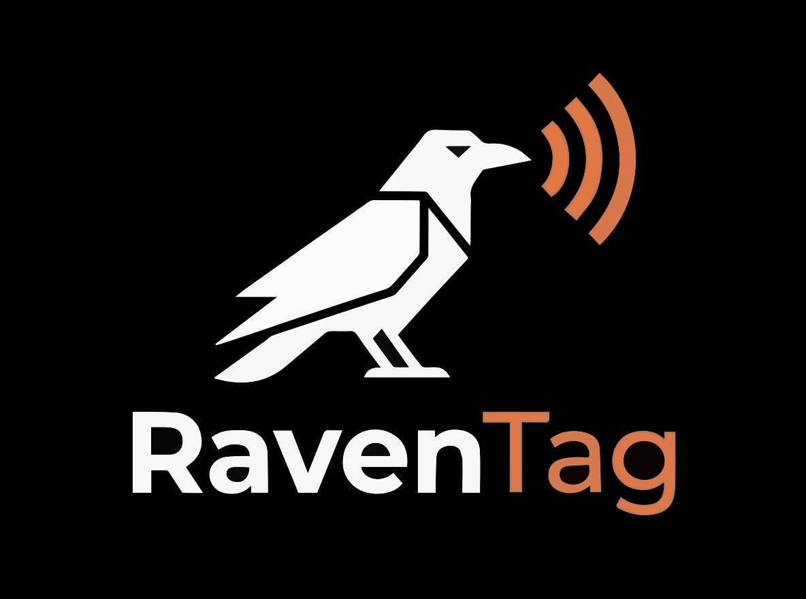

<p align="center">
  
</p>

# RavenTag

[](LICENSE)
[](docs/protocol.md)
[](LICENSE)
[](https://github.com/ALENOC/RavenTag/releases/latest)

**Read this README in other languages:**
[🇮🇹 Italiano](docs/README_IT.md) |
[🇫🇷 Français](docs/README_FR.md) |
[🇩🇪 Deutsch](docs/README_DE.md) |
[🇪🇸 Español](docs/README_ES.md) |
[🇨🇳 中文](docs/README_ZH.md) |
[🇯🇵 日本語](docs/README_JA.md) |
[🇰🇷 한국어](docs/README_KO.md) |
[🇷🇺 Русский](docs/README_RU.md)

---

**RavenTag is an open-source trustless anti-counterfeiting platform. It links NTAG 424 DNA NFC chips to Ravencoin blockchain assets using the RTP-1 protocol, allowing brands to prove the authenticity of physical products without depending on any central authority, including RavenTag itself.**

## Table of contents

- [What is RavenTag?](#what-is-raventag)
- [Why Ravencoin?](#why-ravencoin)
- [Four-layer anti-counterfeiting](#four-layer-anti-counterfeiting)
- [RTP-1 Protocol](#rtp-1-protocol)
- [How it works: full verification flow](#how-it-works-full-verification-flow)
- [Asset hierarchy](#asset-hierarchy)
- [Two Android apps](#two-android-apps)
- [NFC tag behavior](#nfc-tag-behavior)
- [Roles and access levels](#roles-and-access-levels)
- [Backend API overview](#backend-api-overview)
- [Deploy](#deploy)
- [Backend setup](#backend-setup)
- [App Links setup](#app-links-setup)
- [Project structure](#project-structure)
- [Public brand registry](#public-brand-registry)
- [Legal](#legal)
- [Attribution (RTSL-1.0)](#attribution-rtsl-10)

---

## What is RavenTag?

Counterfeiting costs brands and consumers billions every year. Existing anti-counterfeiting solutions are expensive, require trust in a third-party service, and lock brands into proprietary ecosystems.

RavenTag solves this with three combined technologies:

**1. Hardware-secured NFC chip (NTAG 424 DNA)**
Each authenticated product carries an NXP NTAG 424 DNA chip. At every tap the chip produces a unique, cryptographically signed URL using AES-128-CMAC (SUN: Secure Unique NFC). The AES key lives in the chip silicon and cannot be extracted or cloned.

**2. Ravencoin blockchain**
The brand registers each serialised item as a unique on-chain token, for example `FASHIONX/BAG001#SN0001`. The token metadata (stored on IPFS) contains the chip public fingerprint: `nfc_pub_id = SHA-256(chip_uid || BRAND_SALT)`. The blockchain record is permanent, public, and auditable by anyone.

**3. Brand-sovereign key management**
The AES keys are derived on the brand server from `BRAND_MASTER_KEY` using slot-prefixed AES-ECB diversification. Keys never leave the brand server, never reach the consumer browser, never touch RavenTag infrastructure. The consumer only needs to trust the brand server and the public Ravencoin blockchain.

---

## Why Ravencoin?

[Ravencoin](https://ravencoin.org) is a Bitcoin fork built specifically for asset issuance. It was chosen for RavenTag because:

- **Native asset protocol**: root assets, sub-assets, and unique tokens are first-class protocol features. No smart contracts, no bytecode, no attack surface.
- **Asset hierarchy matches brand structure**: BRAND (root) / PRODUCT (sub-asset) / SERIAL#TAG (unique token) maps directly to how brands organise products.
- **KAWPOW proof-of-work**: ASIC-resistant algorithm keeps mining decentralised and the network censorship-resistant.
- **No ICO, no premine**: Ravencoin launched fairly in January 2018 with zero coins pre-allocated. The network is fully community-owned.
- **Parent asset ownership enforced by consensus**: every full node independently verifies that sub-assets are issued only by the parent asset holder. This is the foundation of RavenTag Layer 1 security.
- **Predictable low fees**: 500 RVN for a root asset, 100 RVN per product line, 5 RVN per serialised item. No gas auctions, no congestion surprises.
- **MIT licensed, open source**: no vendor dependency at the blockchain layer.

The RTSL-1.0 license requires all derivative works to use Ravencoin exclusively for all blockchain operations.

---

## Four-layer anti-counterfeiting

RavenTag security does not depend on any single component. Four independent layers must all be compromised simultaneously to forge a valid tag.

| Layer | Technology | What an attacker needs |
|-------|-----------|----------------------|
| **1. Ravencoin consensus** | Parent asset ownership enforced by every node | Must own the parent Ravencoin asset |
| **2. nfc_pub_id binding** | `SHA-256(UID \|\| BRAND_SALT)` in IPFS metadata | Must know `BRAND_SALT` (never public) |
| **3. AES key derivation** | `AES-ECB(BRAND_MASTER_KEY, [slot \|\| UID])` per-chip | Must know `BRAND_MASTER_KEY` (never leaves brand server) |
| **4. NTAG 424 DNA silicon** | Non-clonable NXP hardware, write-protected keys in silicon | Must physically clone NXP silicon (not possible) |

A counterfeit chip cannot pass Layer 4. A counterfeit token cannot pass Layers 1 and 2. A replay attack cannot pass the SUN MAC counter check. All four layers are verified independently on every scan.

---

## RTP-1 Protocol

RTP-1 (RavenTag Protocol v1) defines the JSON schema stored on IPFS and referenced by Ravencoin asset metadata.

### Metadata schema (v1.1)

```json
{
  "raventag_version": "RTP-1",
  "parent_asset": "FASHIONX",
  "sub_asset": "FASHIONX/BAG001",
  "variant_asset": "SN0001",
  "nfc_pub_id": "<sha256hex>",
  "crypto_type": "ntag424_sun",
  "algo": "aes-128",
  "image": "ipfs://<cid>",
  "description": "<product description>"
}
```

**Field descriptions:**
- `raventag_version`: Protocol version (always "RTP-1")
- `parent_asset`: Root asset name (e.g., "FASHIONX")
- `sub_asset`: Full sub-asset path (e.g., "FASHIONX/BAG001")
- `variant_asset`: Unique token serial (e.g., "SN0001") - present only for unique tokens
- `nfc_pub_id`: SHA-256(UID || BRAND_SALT) - the chip's public fingerprint
- `crypto_type`: NFC crypto type (always "ntag424_sun" for NTAG 424 DNA)
- `algo`: Encryption algorithm (always "aes-128")
- `image`: IPFS URI of the product image (optional)
- `description`: Product description (optional)

### Key derivation formula

```
sdmmacInputKey = AES-128-ECB(BRAND_MASTER_KEY, [0x01 || UID[0..6] || 0x00...])
sdmEncKey      = AES-128-ECB(BRAND_MASTER_KEY, [0x02 || UID[0..6] || 0x00...])
sdmMacKey      = AES-128-ECB(BRAND_MASTER_KEY, [0x03 || UID[0..6] || 0x00...])
nfc_pub_id     = SHA-256(UID || BRAND_SALT)
```

All derivations run server-side via `POST /api/brand/derive-chip-key`. The master key never leaves the backend. A brand needs only one master key: every chip key can be re-derived at any time from the chip UID.

### Per-chip key roles

| Slot | Key Name | Role |
|------|----------|------|
| 0x00 | appMasterKey | NTAG 424 DNA Application Master Key (Key 0) |
| 0x01 | sdmmacInputKey | SDM MAC Input Key (Key 1, reserved for future use) |
| 0x02 | sdmEncKey | Encrypts PICCData (UID + counter) → URL parameter "e" |
| 0x03 | sdmMacKey | Base for session MAC key derivation → URL parameter "m" |

---

## How it works: full verification flow

```
Brand programs the chip (once, at manufacture):
  Brand Android App taps chip, reads 7-byte UID
  App calls POST /api/brand/derive-chip-key (HTTPS, admin auth)
  Backend derives 4 per-chip AES-128 keys from BRAND_MASTER_KEY + UID
  App uploads RTP-1 metadata JSON to IPFS via Pinata, gets CIDv0 hash
  App issues Ravencoin unique token with IPFS hash via BIP44 wallet
  App writes AES keys + SUN URL to chip via ISO 7816-4 APDUs
  App calls POST /api/brand/register-chip to record UID on backend

Consumer scans the chip (any number of times):
  Consumer taps phone to NFC chip
  Chip generates: https://verify.brand.com/verify?asset=X&e=ENC&m=MAC
    e = AES-128-CBC(sdmEncKey, IV=0, [0xC7 || UID[0..6] || counter[3 bytes] || padding])
    m = Truncated_CMAC(session_mac_key, empty_input)[odd_bytes]  (8 bytes = 16 hex chars)
    session_mac_key = CMAC(sdmMacKey, SV2) where SV2 includes UID + counter
  Brand server receives {asset, e, m}:
    1. Derives session MAC key from sdmMacKey + UID + counter
    2. Verifies MAC: Truncated_CMAC(session_mac_key, empty) == m
    3. Decrypts e: recovers UID and tap counter
    4. Checks counter > stored counter (anti-replay)
    5. Fetches Ravencoin asset metadata (IPFS via backend cache)
    6. Computes SHA-256(UID || BRAND_SALT), matches against nfc_pub_id in metadata
    7. Checks revocation list (SQLite)
    8. Returns: { authentic: true/false, revoked: false/true, reason }
```

---

## Asset hierarchy

Ravencoin supports a three-level hierarchy. RavenTag uses all three levels:

```
FASHIONX                       Root asset      500 RVN   (brand identity)
FASHIONX/BAG001                Sub-asset       100 RVN   (product line)
FASHIONX/BAG001#SN0001         Unique token      5 RVN   (individual serialised item)
```

Each unique token (`#` prefix) is non-fungible by protocol design. Its IPFS metadata contains the `nfc_pub_id` linking it to a specific physical chip.

**Cost example:** one brand, one product line, 200 serialised items:
`500 + 100 + (200 x 5) = 1,600 RVN` plus approximately 2 RVN in transfer fees.

---

## Two Android apps

Both apps are open source, available in 9 languages (EN, IT, FR, DE, ES, ZH, JA, KO, RU), and white-label ready. A detailed overview is also available at [raventag.com/apps](https://raventag.com/apps).

### RavenTag Verify (consumer app for end users)

Download: [RavenTag-Verify-v1.0.5.apk](https://github.com/ALENOC/RavenTag/releases/latest)

| Capability | Details |
|---|---|
| Scan NFC tags | Tap NTAG 424 DNA chips, view AUTHENTIC / REVOKED result |
| Full verification | SUN MAC + Ravencoin blockchain + revocation check |
| Ravencoin wallet | BIP44 `m/44'/175'/0'/0/0`, BIP39 12-word mnemonic, AES-256-GCM storage |
| Multi-language | EN, IT, FR, DE, ES, ZH, JA, KO, RU |
| Legal acceptance | Terms of Service + Privacy Policy acceptance on first launch |

Build: `./gradlew assembleConsumerRelease`

### RavenTag Brand Manager (operator and brand team app)

Download: [RavenTag-Brand-v1.0.5.apk](https://github.com/ALENOC/RavenTag/releases/latest)

| Capability | Details |
|---|---|
| Issue Ravencoin assets | Root (500 RVN), sub-asset (100 RVN), unique token (5 RVN) |
| Derive chip keys | Calls backend `derive-chip-key`, keys never generated on-device |
| Program NTAG 424 DNA chips | AES-128 keys + SUN URL via ISO 7816-4 APDUs |
| Auto-register chip | Backend registration immediately after programming |
| HD wallet | BIP44 `m/44'/175'/0'/0/0`, local UTXO signing, BIP39 12-word mnemonic |
| Transfer / Revoke | Full asset lifecycle management |
| Product images | CID computed on-device, metadata uploaded to IPFS via Pinata |
| Multi-language | EN, IT, FR, DE, ES, ZH, JA, KO, RU |

Build: `./gradlew assembleBrandRelease`

---

## NFC tag behavior

The behavior when a consumer taps an NFC tag depends on whether the RavenTag Verify app is installed.

**App installed (Android App Links):**
The tag URL (`https://yourdomain.com/verify?...`) is intercepted directly by the RavenTag Verify app. The app opens the Scan screen and performs full verification immediately. The browser is never opened.

**App not installed:**
The tag URL opens in the phone browser. The browser connects to `https://yourdomain.com/verify` (without query parameters) and displays a branded install page: the RavenTag logo, a description, and a download button. The user can tap the button to download the APK or visit the releases page.

**App open on a different screen:**
NFC foreground dispatch is active on the Scan tab and during the tag programming flow (while waiting for a tag tap to program). On all other screens the tag tap is ignored by the app and handled by Android normally (browser install page).

### Configure the install page

Set these environment variables on the backend:

```bash
# Direct link to the RavenTag Verify APK (update with each release)
VERIFY_APK_URL=https://github.com/ALENOC/RavenTag/releases/download/v1.0.5/RavenTag-Verify-v1.0.5.apk

# SHA-256 fingerprint(s) of release signing certificate(s) for Android App Links
# RTSL-1.0 LICENSE REQUIREMENT: RavenTag fingerprint MUST be included.
# RavenTag Verify fingerprint: 3EA5B9F375631A4E1DE95DE1DA9C2245141E4AD8FA7A63787D6AB98196B4A3BE
#
# RavenTag Verify only:
ANDROID_APP_FINGERPRINT=3EA5B9F375631A4E1DE95DE1DA9C2245141E4AD8FA7A63787D6AB98196B4A3BE
#
# Brand + RavenTag Verify (comma-separated, RavenTag REQUIRED):
ANDROID_APP_FINGERPRINT=BRAND_FINGERPRINT,3EA5B9F375631A4E1DE95DE1DA9C2245141E4AD8FA7A63787D6AB98196B4A3BE
ANDROID_APP_FINGERPRINT=<YOUR_APP_FINGERPRINT>
```

**To get your fingerprint:**

```bash
keytool -list -v -keystore android/signing/raventag-release.keystore -alias raventag | grep SHA256
```

Remove colons and convert to uppercase: `AA:BB:CC:DD...` → `AABBCCDD...`

---

## Roles and access levels

Roles are set at wallet creation time by entering a control key (admin or operator). The app determines the role automatically by validating the key against the backend. The role is locked to the wallet and cannot be changed in settings.

| Role | Control Key | Android app permissions |
|---|---|---|
| **Admin** | Admin Key (`X-Admin-Key`) | All operations: issue root/sub assets, issue unique tokens, revoke/un-revoke, send RVN, transfer all asset types |
| **Operator** | Operator Key (`X-Operator-Key`) | Issue unique tokens only. Send RVN, create root/sub assets, revoke/un-revoke, and transfer root/sub assets are locked. |

**Use case:** A brand admin pre-configures multiple operator devices on the same wallet that holds the owner assets. Each operator device can issue unique tokens (serials) without access to asset management or the wallet. The operator holds the owner tokens in the shared wallet and needs them to issue unique tokens on-chain.

**Backend-level permissions:**

| Role | Header | Backend access |
|---|---|---|
| **Admin** | `X-Admin-Key` | Issue assets, revoke, transfer, wallet, manage chips, derive chip keys |
| **Operator** | `X-Operator-Key` | Derive chip keys, register chips, issue unique tokens |

---

## Backend API overview

| Method | Endpoint | Auth | Description |
|--------|----------|------|-------------|
| `GET` | `/health` | None | Health check |
| `GET` | `/verify` | None | Browser install page (shown when app is not installed) |
| `GET` | `/.well-known/assetlinks.json` | None | Android App Links verification |
| `GET` | `/api/assets` | None | List registered assets |
| `GET` | `/api/assets/:name` | None | Get asset details |
| `GET` | `/api/assets/:name/revocation` | None | Check revocation status (public) |
| `POST` | `/api/verify/sun` | Operator | Verify SUN MAC from NFC URL parameters (raw keys in body) |
| `POST` | `/api/verify/full` | None | Full verification: MAC + blockchain + revocation |
| `POST` | `/api/brand/derive-chip-key` | Admin | Derive AES-128 keys for a chip UID |
| `POST` | `/api/brand/register-chip` | Admin or Operator | Register a programmed chip UID |
| `GET` | `/api/brand/chips` | Admin | List all registered chips |
| `POST` | `/api/brand/revoke` | Admin | Revoke an asset (backend revocation) |
| `DELETE` | `/api/brand/revoke/:name` | Admin | Un-revoke an asset |
| `GET` | `/api/brand/revoked` | Admin | List all revoked assets |
| `GET` | `/api/metrics` | Admin | Request stats for the last 24 hours |
| `GET` | `/api/registry/brands` | None | Public list of registered brands |
| `GET` | `/api/registry/emissions` | None | Public on-chain emission log |

Authentication headers accepted: `X-Admin-Key` or `X-Api-Key` for admin, `X-Operator-Key` for operator.

> All Ravencoin wallet operations (asset issuance, transfers, RVN sends) are performed exclusively by the Android app via ElectrumX on-device signing. The backend holds no Ravencoin wallet.

---

## Deploy

The backend is a Node.js + Express process with a SQLite database. It runs on any Linux VPS or container platform with persistent storage.

```
              DNS + CDN + SSL (your provider)
                       |
         +-------------+-------------+
         |                           |
  api.yourbrand.com          raventag.com
  Linux VPS or container       Next.js 14 frontend
  Node.js 20 + SQLite          (self-hosted optional)
  /data/raventag.db
```

Once deployed, your brand infrastructure is independent from RavenTag.com. The site is used only for documentation, app downloads, and the optional public brand registry.

---

## Backend setup

### First deploy

Secret keys are stored as plain-text files in `./secrets/` on the host. Docker Compose mounts them into the container as read-only files at `/run/secrets/<name>`. They are never passed as environment variables and never appear in `docker inspect` output.

**Step 1: Generate and save secret keys (do this once)**

```bash
git clone https://github.com/ALENOC/RavenTag.git && cd RavenTag
mkdir -p secrets

# Sensitive keys: write to ./secrets/ files, never commit these files
openssl rand -hex 16 > secrets/brand_master_key   # AES-128 master key (32 hex chars)
openssl rand -hex 16 > secrets/brand_salt          # nfc_pub_id salt (32 hex chars)
openssl rand -hex 24 > secrets/admin_key           # admin API key (48 hex chars)
openssl rand -hex 24 > secrets/operator_key        # operator API key (48 hex chars)
touch secrets/rvn_rpc_user secrets/rvn_rpc_pass    # leave empty if no local RVN node
```

**Write these values down and store them in a password manager before continuing.** `brand_master_key` and `brand_salt` cannot be changed after the first chip is programmed. Losing either key invalidates all previously programmed chips.

**Step 2: Configure non-secret settings**

```bash
cp .env.example .env
# Edit .env: set BRAND_NAME, ALLOWED_ORIGINS, IPFS_GATEWAY
# Set VERIFY_APK_URL and ANDROID_APP_FINGERPRINT for the browser install page
```

Non-secret `.env` variables:

| Variable | Description |
|---|---|
| `BRAND_NAME` | Your brand name. Used for display purposes in the app. |
| `ALLOWED_ORIGINS` | CORS origins (comma-separated). Set to your frontend domain. |
| `IPFS_GATEWAY` | IPFS HTTP gateway for metadata fetches. Default: ipfs.io. |
| `RVN_RPC_HOST` | Ravencoin node host. Optional: public node is used as fallback. |
| `VERIFY_APK_URL` | Direct download URL for the RavenTag Verify APK. Shown on the browser install page. |
| `ANDROID_APP_FINGERPRINT` | SHA-256 certificate fingerprint for Android App Links. |

**Step 3: Start the backend**

```bash
docker compose up -d backend
```

The SQLite database is stored at `/data/raventag.db` inside the container, mapped to a named Docker volume. The `./secrets/` directory stays on the host and survives all future upgrades.

### Upgrading

```bash
git pull origin master
docker compose up -d --build backend
```

### Reverse proxy and SSL (nginx example)

```nginx
server {
    listen 443 ssl;
    server_name api.yourbrand.com;

    ssl_certificate     /etc/letsencrypt/live/api.yourbrand.com/fullchain.pem;
    ssl_certificate_key /etc/letsencrypt/live/api.yourbrand.com/privkey.pem;

    location / {
        proxy_pass http://127.0.0.1:3001;
        proxy_set_header Host $host;
        proxy_set_header X-Real-IP $remote_addr;
    }
}
```

Get a free SSL certificate: `certbot --nginx -d api.yourbrand.com`

---

## App Links setup

Android App Links allow the RavenTag Verify app to intercept NFC tag URLs directly, without opening a browser. This requires:

**1. Add `autoVerify` to the app manifest** (already done in the source code):
```xml
<intent-filter android:autoVerify="true">
    <action android:name="android.nfc.action.NDEF_DISCOVERED"/>
    ...
</intent-filter>
```

**2. Serve the Digital Asset Links file** from your backend domain:

The backend automatically serves `/.well-known/assetlinks.json` when `ANDROID_APP_FINGERPRINT` is set.

**3. Get your signing certificate fingerprint:**

```bash
keytool -list -v -keystore android/signing/raventag-release.keystore -alias raventag
```

Copy the `SHA256:` line from the output and set it in your backend `.env`:

```bash
# RavenTag Verify only (REQUIRED):
ANDROID_APP_FINGERPRINT=3E:A5:B9:F3:75:63:1A:4E:1D:E9:5D:E1:DA:9C:22:45:14:1E:4A:D8:FA:7A:63:78:7D:6A:B9:81:96:B4:A3:BE

# Brand + RavenTag Verify (RavenTag fingerprint REQUIRED by RTSL-1.0):
ANDROID_APP_FINGERPRINT=BRAND_FP:AA:BB:CC:DD,3E:A5:B9:F3:75:63:1A:4E:1D:E9:5D:E1:DA:9C:22:45:14:1E:4A:D8:FA:7A:63:78:7D:6A:B9:81:96:B4:A3:BE
```

**RTSL-1.0 License Requirement:**
The RavenTag Verify fingerprint MUST be included in all deployments. The backend will reject configurations that do not include it.

**Release fingerprint:**
```
3E:A5:B9:F3:75:63:1A:4E:1D:E9:5D:E1:DA:9C:22:45:14:1E:4A:D8:FA:7A:63:78:7D:6A:B9:81:96:B4:A3:BE
```

**4. Verify the setup** after deploying:

```bash
curl https://yourdomain.com/.well-known/assetlinks.json
```

The response should contain your package name (`io.raventag.app`) and certificate fingerprint.

---

## Project structure

```
RavenTag/
├── .github/
│   ├── ISSUE_TEMPLATE/     bug_report.md, feature_request.md,
│   │                       security_issue.md, config.yml
│   ├── CODEOWNERS
│   ├── CONTRIBUTING.md
│   └── PULL_REQUEST_TEMPLATE.md
├── android/
│   ├── app/
│   │   ├── src/
│   │   │   ├── androidTest/    WalletManagerTest.kt
│   │   │   ├── brand/          Brand Manager flavor (AppConfig.kt)
│   │   │   ├── consumer/       Consumer Verify flavor (AppConfig.kt, strings.xml)
│   │   │   └── main/
│   │   │       ├── java/io/raventag/app/
│   │   │       │   ├── ipfs/           IpfsResolver.kt, KuboUploader.kt,
│   │   │       │   │                   PinataUploader.kt
│   │   │       │   ├── network/        NetworkModule.kt
│   │   │       │   ├── nfc/            NfcReader.kt, Ntag424Configurator.kt,
│   │   │       │   │                   SunVerifier.kt, NfcCounterCache.kt
│   │   │       │   ├── ravencoin/      RpcClient.kt
│   │   │       │   ├── ui/
│   │   │       │   │   ├── screens/    ScanScreen.kt, VerifyScreen.kt,
│   │   │       │   │   │               IssueAssetScreen.kt, BrandDashboardScreen.kt,
│   │   │       │   │   │               OnboardingScreen.kt, ProgramTagScreen.kt,
│   │   │       │   │   │               WalletScreen.kt, SendRvnScreen.kt,
│   │   │       │   │   │               TransferScreen.kt, ReceiveScreen.kt,
│   │   │       │   │   │               SettingsScreen.kt, SplashScreen.kt,
│   │   │       │   │   │               RegisterChipScreen.kt, WriteTagScreen.kt,
│   │   │       │   │   │               MnemonicBackupScreen.kt, QrScannerScreen.kt,
│   │   │       │   │   │               ImagePickerButton.kt, QrUtils.kt
│   │   │       │   │   └── theme/      Theme.kt, AppStrings.kt, LocalStrings.kt
│   │   │       │   ├── wallet/         WalletManager.kt (BIP44/BIP39),
│   │   │       │   │                   AssetManager.kt, RavencoinTxBuilder.kt,
│   │   │       │   │                   RavencoinPublicNode.kt,
│   │   │       │   │                   RvnHashrateFetcher.kt, RvnPriceFetcher.kt
│   │   │       │   └── worker/         WalletPollingWorker.kt,
│   │   │       │                       NotificationHelper.kt
│   │   │       └── AndroidManifest.xml
│   │   ├── build.gradle.kts
│   │   └── proguard-rules.pro
│   ├── build.gradle.kts
│   ├── gradle.properties
│   ├── gradlew
│   └── settings.gradle.kts
├── backend/
│   ├── public/             logo.svg (served inline on browser install page)
│   ├── src/
│   │   ├── routes/         brand.ts, verify.ts, assets.ts, admin.ts, registry.ts
│   │   ├── services/       ntag424.ts (SUN decrypt + MAC verify),
│   │   │                   ravencoin.ts (RPC client),
│   │   │                   electrumx.ts, ipfs.ts
│   │   ├── middleware/     auth.ts (admin/operator), cache.ts,
│   │   │                   logger.ts, migrations.ts
│   │   └── utils/          crypto.ts (AES-CMAC, SHA-256, deriveTagKeys),
│   │                       validation.ts
│   ├── index.ts            Express server entry point
│   ├── Dockerfile
│   ├── package.json
│   ├── tsconfig.json
│   └── SETUP_INFO.txt
├── docs/
│   ├── deploy/             Deployment guides (en, it, de, fr, es, zh, ja, ko, ru)
│   ├── legal/
│   │   ├── TERMS_OF_SERVICE.md       (9 languages)
│   │   └── PRIVACY_POLICY.md         (9 languages)
│   ├── protocol.md         RTP-1 protocol specification
│   ├── architecture.md     System architecture
│   ├── functional-report.md
│   ├── app_store_descriptions.txt
│   ├── release_notes.txt
│   ├── README_IT.md        Italian translation
│   ├── README_FR.md        French translation
│   ├── README_DE.md        German translation
│   ├── README_ES.md        Spanish translation
│   ├── README_ZH.md        Chinese translation
│   ├── README_JA.md        Japanese translation
│   ├── README_KO.md        Korean translation
│   └── README_RU.md        Russian translation
├── pictures/               Logo assets (RavenTag_Logo.jpg)
├── docker-compose.yml      Docker Compose configuration
├── LICENSE                 RavenTag Source License (RTSL-1.0)
└── NOTICE                  Notice file
```

---

## Public brand registry

Brands are automatically registered in the public RavenTag directory at raventag.com/brands when a root asset is first issued via the Brand Manager app.

The registry shows only: brand name and registration date. No private data is shared.

---

## Legal

By using the RavenTag Verify or Brand Manager apps, users accept the following documents shown during onboarding:

- [Terms of Service](docs/legal/TERMS_OF_SERVICE.md): covers eligibility (18+), non-custodial wallet responsibility, financial risks of Ravencoin, irreversible transactions, NFC hardware limitations, limitation of liability.
- [Privacy Policy](docs/legal/PRIVACY_POLICY.md): GDPR-compliant, describes what data is collected and why (IP for rate limiting, NFC verification parameters), confirms keys and mnemonic phrases never leave the device.

Both documents are shown with mandatory acceptance checkboxes during first launch. The "Get Started" button is disabled until both are accepted.

For legal inquiries: legal@raventag.com

---

## Attribution (RTSL-1.0)

RavenTag is released under the **RavenTag Source License (RTSL-1.0)**. This license:

- Permits personal, educational, and non-commercial use freely.
- Permits brands to deploy RavenTag on their own infrastructure to authenticate their own physical products (no fee required).
- **Requires** that all derivative works and deployments use the Ravencoin blockchain exclusively for all blockchain operations. Switching to any other chain (Ethereum, Solana, Bitcoin, etc.) is explicitly prohibited.
- **Requires** attribution: retain the copyright notice, link to this repository, and display the RavenTag name and logo in public-facing documentation or app About screens.
- **Requires** share-alike: derivative works distributed to third parties must be released under RTSL-1.0.
- **Requires** prior written authorization from the copyright holder for commercial use as a hosted service, SDK, or consulting deliverable (cases b, c, d in the license).

See [LICENSE](LICENSE) for the full text.

[](LICENSE)
